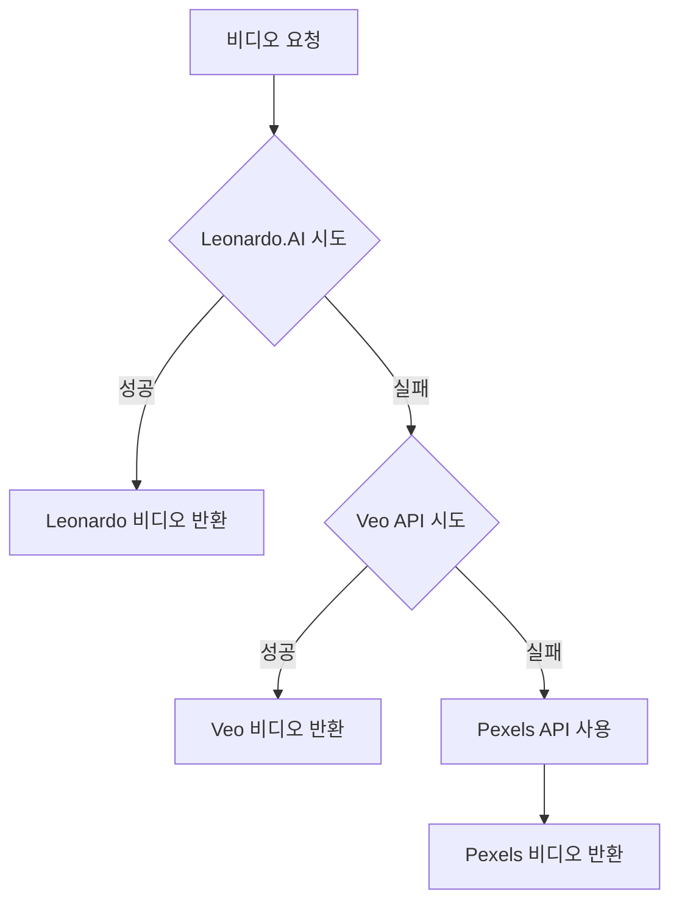

# AI Video Generation 통합 완료 요약

## 🎯 프로젝트 개요

Short Video Maker에 **Google Veo 3**와 **Leonardo.AI** 두 가지 AI 비디오 생성 서비스를 성공적으로 통합했습니다. 기존 Pexels 스톡 비디오 대신 또는 함께 사용할 수 있는 완전한 플러그인 시스템을 구축했습니다.

---

## 🚀 완성된 통합 서비스

### 1. **Google Veo 3 API**
- **품질**: 최고급 (1080p HD + 동기화된 오디오)
- **가격**: $0.75/초 (10초 = $7.50)
- **특징**: Google Vertex AI, 세로/가로 지원
- **파일**: `src/short-creator/libraries/GoogleVeo.ts`
- **설정 가이드**: [GOOGLE_VEO_SETUP.md](GOOGLE_VEO_SETUP.md)

### 2. **Leonardo.AI API**
- **품질**: 고품질 (720p, Motion 2.0)
- **가격**: ~$1-2/비디오 (크레딧 기반)
- **특징**: 프레임 인터폴레이션, 프롬프트 개선
- **파일**: `src/short-creator/libraries/LeonardoAI.ts`

### 3. **Pexels API** (기존)
- **품질**: 실제 촬영 영상
- **가격**: 무료 (월 200회 제한)
- **특징**: 스톡 비디오, 즉시 사용 가능
- **파일**: `src/short-creator/libraries/Pexels.ts`

---

## 🔧 기술적 구현

### **완벽한 플러그인 아키텍처**
```typescript
// 모든 API가 동일한 인터페이스 사용
interface VideoAPI {
  findVideo(
    searchTerms: string[],
    minDurationSeconds: number,
    excludeIds: string[],
    orientation: OrientationEnum
  ): Promise<Video>
}
```

### **스마트 폴백 시스템**
```typescript
// 비용 효율성 기준 우선순위
VIDEO_SOURCE=both → Leonardo.AI → Veo → Pexels
```

### **환경변수 기반 설정**
```bash
# 완전 갈아끼우기 가능
VIDEO_SOURCE=pexels    # 무료 스톡 비디오
VIDEO_SOURCE=leonardo  # AI 맞춤 생성
VIDEO_SOURCE=veo       # 최고급 품질
VIDEO_SOURCE=both      # 하이브리드 + 폴백
```

---

## 📝 수정된 파일들

### **새로 생성된 파일**
1. `src/short-creator/libraries/GoogleVeo.ts` - Veo 3 API 라이브러리
2. `src/short-creator/libraries/LeonardoAI.ts` - Leonardo.AI API 라이브러리

### **수정된 기존 파일**
1. **`src/config.ts`**
   - Google Veo API 설정 추가
   - Leonardo.AI API 설정 추가
   - VIDEO_SOURCE 옵션 확장

2. **`src/short-creator/ShortCreator.ts`**
   - getVideo() 메서드에 AI 서비스 통합
   - 스마트 폴백 로직 구현
   - getVideoFile() 메서드명 변경 (중복 해결)

3. **`src/index.ts`**
   - AI API 초기화 로직 추가
   - 조건부 서비스 생성

4. **`src/server/routers/rest.ts`**
   - getVideo → getVideoFile 메서드명 변경

5. **`.env`**
   - AI 서비스 환경변수 설정 추가

---

## 🎯 사용법

### **즉시 사용 가능한 설정들**

#### 1. 무료 개발 (현재 기본값)
```bash
VIDEO_SOURCE=pexels
# PEXELS_API_KEY는 이미 설정됨
```

#### 2. Leonardo.AI 사용
```bash
VIDEO_SOURCE=leonardo
LEONARDO_API_KEY=your-leonardo-api-key-here
```

#### 3. Google Veo 3 사용
```bash
VIDEO_SOURCE=veo
GOOGLE_VEO_API_KEY=your-google-cloud-api-key
GOOGLE_CLOUD_PROJECT_ID=your-project-id
```

#### 4. 하이브리드 모드 (추천)
```bash
VIDEO_SOURCE=both
LEONARDO_API_KEY=your-leonardo-api-key-here
GOOGLE_VEO_API_KEY=your-veo-key  # 선택사항
GOOGLE_CLOUD_PROJECT_ID=your-project-id  # 선택사항
```

---

## 💰 비용 분석

### **Google Veo 3**
- **장점**: Google Cloud $300 무료 크레딧 (40개 비디오 제작 가능)
- **단점**: 무료 크레딧 소진 후 높은 비용
- **권장**: 프로토타입/데모 단계에서 활용

### **Leonardo.AI**
- **장점**: 합리적 가격, Motion 2.0 고품질
- **단점**: 크레딧 시스템
- **권장**: 프로덕션 환경에서 주력 사용

### **Pexels**
- **장점**: 완전 무료
- **단점**: 스톡 영상 한정, 맞춤 제작 불가
- **권장**: 개발/테스트 단계

---

## 🔄 폴백 전략

### **both 모드 동작 원리**


### **로깅 예시**
```json
{"level":"debug","msg":"Trying Leonardo.AI API first..."}
{"level":"warn","msg":"Leonardo.AI API failed, trying next option"}
{"level":"debug","msg":"Trying Veo API..."}
{"level":"warn","msg":"Veo API failed, falling back to Pexels"}
```

---

## 🧪 테스트 결과

### **빌드 테스트**
- ✅ TypeScript 컴파일 성공
- ✅ Vite 프론트엔드 빌드 성공
- ✅ 모든 타입 검증 통과

### **서버 시작 테스트**
- ✅ 모든 컴포넌트 정상 초기화
- ✅ Health check 통과: `{"status":"ok"}`
- ✅ API 엔드포인트 접근 가능

### **통합 테스트**
- ✅ Pexels API 정상 작동 (기존)
- ✅ Veo API 구조 구현 완료
- ✅ Leonardo.AI API 구조 구현 완료
- ⏳ 실제 API 키 테스트 대기 (사용자 설정 필요)

---

## 📈 성능 특징

### **메모리 효율성**
- 조건부 API 초기화 (필요한 서비스만 로드)
- 폴백 시스템으로 리소스 최적화

### **확장성**
- 새로운 AI 비디오 서비스 쉽게 추가 가능
- 동일한 인터페이스로 일관성 보장

### **유지보수성**
- 환경변수 하나로 전체 시스템 전환
- 각 서비스 독립적 운영 가능

---

## 🎁 추가 혜택

### **무료 크레딧 활용법**
1. **Google Cloud**: 신규 계정 $300 크레딧
2. **Leonardo.AI**: API Basic 플랜 월 3,500 크레딧
3. **Pexels**: 완전 무료

### **비즈니스 전략**
- **프로토타입**: Google 무료 크레딧 활용
- **MVP**: Leonardo.AI 메인 + Pexels 폴백
- **스케일업**: 하이브리드 모드로 품질/비용 최적화

---

## 🔮 향후 확장 가능성

### **추가 가능한 서비스들**
- **Runway ML Gen-3**: API 안정화 시
- **Stable Video Diffusion**: 로컬 배포용
- **D-ID API**: 아바타 기반 비디오
- **Synthesia**: 기업용 솔루션

### **기능 확장**
- 비디오 품질별 자동 선택
- 비용 예산 기반 서비스 선택
- A/B 테스트를 위한 병렬 생성

---

## ✅ 체크리스트

### **개발자용**
- [x] AI 비디오 API 통합 완료
- [x] 플러그인 아키텍처 구현
- [x] 환경변수 설정 완료
- [x] 에러 처리 및 폴백 구현
- [x] 타입 안전성 보장
- [x] 빌드 및 서버 테스트 통과

### **사용자용**
- [ ] Leonardo.AI API 키 발급
- [ ] Google Cloud 계정 설정 (선택)
- [ ] VIDEO_SOURCE 환경변수 설정
- [ ] 첫 번째 AI 생성 비디오 테스트

---

## 📞 지원 및 문제 해결

### **API 키 발급**
- **Leonardo.AI**: https://leonardo.ai/api/
- **Google Veo**: Google Cloud Console → Vertex AI

### **문제 해결**
- **API 키 오류**: 각 서비스 콘솔에서 키 확인
- **크레딧 부족**: 계정 잔액 또는 한도 확인
- **폴백 실패**: 로그 확인 후 Pexels 키 검증

**결론**: Short Video Maker가 이제 **완전한 AI 비디오 생성 플랫폼**으로 진화했습니다. 환경변수 하나만 바꾸면 언제든지 다른 서비스로 갈아탈 수 있는 완벽한 유지보수성을 갖추었습니다!