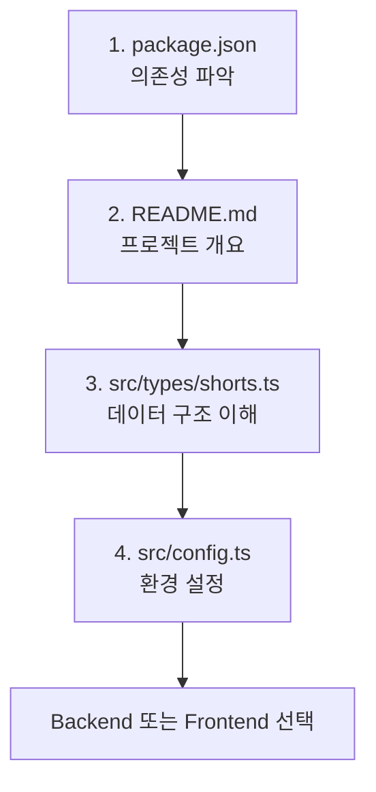
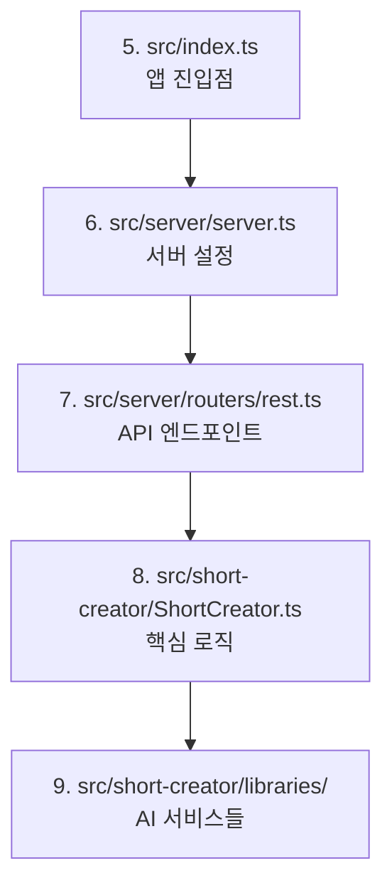
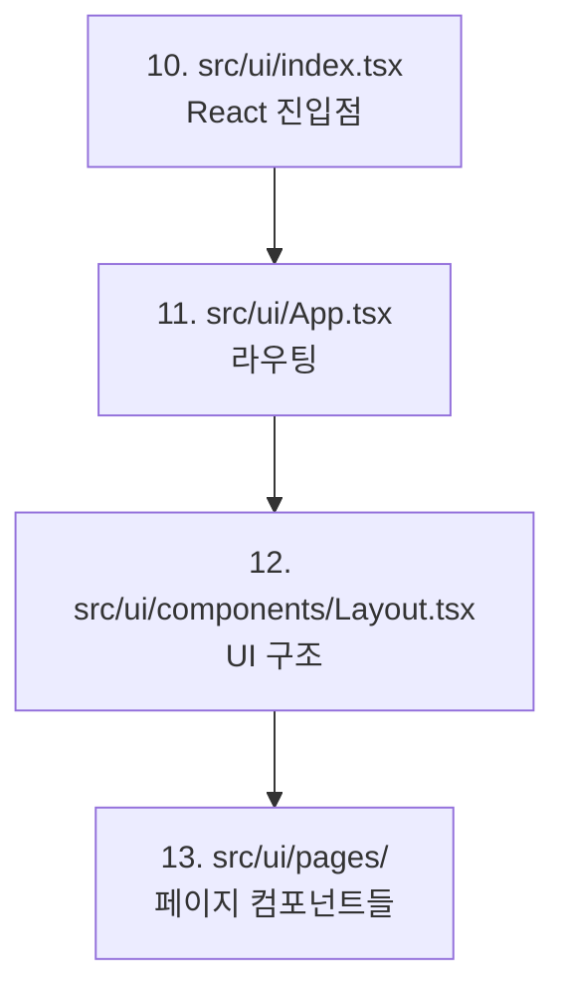
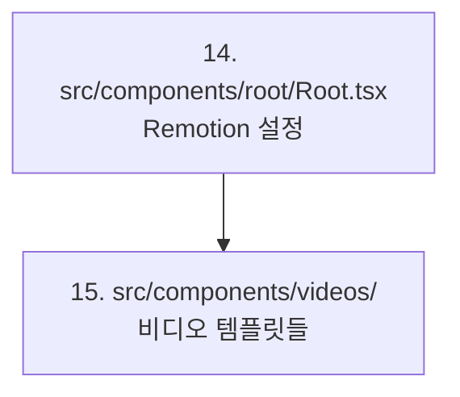
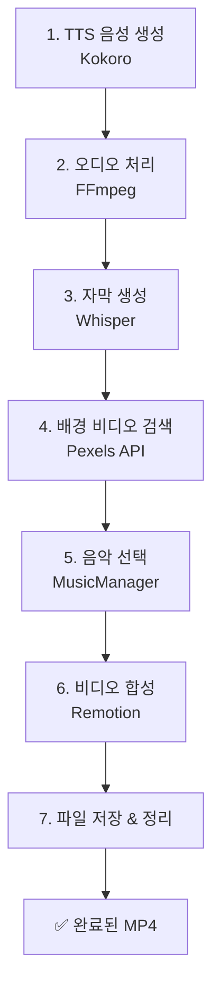
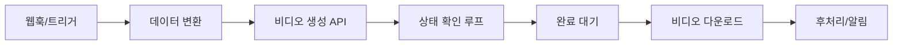

# Short Video Maker - 비디오 생성 워크플로우 완전 분석

## 🎯 개요

Short Video Maker의 텍스트에서 완성된 MP4 비디오까지의 전체 프로세스를 단계별로 상세하게 설명합니다. 
n8n 자동화 연동과 코드 분석을 위한 완전한 기술 문서입니다.

---

## 📋 목차

1. [Frontend/Backend 파일 구조 분석](#1-frontendbackend-파일-구조-분석)
2. [시스템 진입점과 초기화](#2-시스템-진입점과-초기화)
3. [API 요청 흐름](#3-api-요청-흐름)
4. [비디오 생성 파이프라인](#4-비디오-생성-파이프라인)
5. [핵심 컴포넌트 분석](#5-핵심-컴포넌트-분석)
6. [파일 처리와 저장](#6-파일-처리와-저장)
7. [설정과 구성](#7-설정과-구성)
8. [에러 처리와 상태 추적](#8-에러-처리와-상태-추적)
9. [n8n 연동 포인트](#9-n8n-연동-포인트)
10. [데이터 구조와 스키마](#10-데이터-구조와-스키마)

---

## 1. Frontend/Backend 파일 구조 분석

### 🗂️ 아키텍처 개요

Short Video Maker는 다음으로 구성된 풀스택 애플리케이션입니다:
- **Backend**: Node.js/Express + TypeScript (REST API + MCP 프로토콜)
- **Frontend**: React + Vite + Material-UI
- **Video Processing**: Remotion 기반 비디오 생성 + AI 서비스들
- **Core Logic**: TTS, 자막, 배경 비디오, 음악을 조합한 비디오 생성 파이프라인

---

### 🎨 Frontend 파일 구조

#### 📍 진입점과 핵심 구조

**메인 진입점**:
```
src/ui/index.tsx ← React 앱 시작점
└── src/ui/App.tsx ← 라우터 설정 (3개 라우트)
    ├── / → VideoList (홈페이지)
    ├── /create → VideoCreator (비디오 생성)
    └── /video/:id → VideoDetails (비디오 상세)
```

#### 🏗️ UI 컴포넌트와 페이지

**레이아웃 시스템**:
- **`src/ui/components/Layout.tsx`**
  - Material-UI 테마 적용
  - 헤더바 + 네비게이션
  - "Short Video Maker" 브랜딩
  - "Create Video" 버튼

**핵심 페이지들**:
- **`src/ui/pages/VideoList.tsx`** (홈페이지)
  - 생성된 비디오 목록 표시
  - API: `GET /api/short-videos`
  - 상태 표시: ready/processing/failed
  - 삭제 기능 + 상세 페이지 이동

- **`src/ui/pages/VideoCreator.tsx`** (비디오 생성)
  - 복합 폼: 다중 Scene 입력
  - 텍스트 + 검색 키워드 입력
  - 설정: 음성, 음악, 방향, 자막 위치
  - API 호출: `GET /api/voices`, `GET /api/music-tags`
  - 제출: `POST /api/short-video`

- **`src/ui/pages/VideoDetails.tsx`** (비디오 상세)
  - 개별 비디오 상세 정보
  - 상태 모니터링 + 비디오 미리보기

#### 🔗 Frontend-Backend API 연동

```typescript
// 주요 API 호출들
GET /api/short-videos        // 비디오 목록
POST /api/short-video        // 새 비디오 생성
GET /api/short-video/:id/status  // 상태 확인
DELETE /api/short-video/:id  // 비디오 삭제
GET /api/voices             // 사용 가능한 음성
GET /api/music-tags         // 음악 분위기 옵션
```

#### 🎨 스타일링
- **`src/ui/styles/index.css`**
  - 글로벌 CSS 스타일
  - Tailwind CSS (PostCSS 통합)

---

### 🖥️ Backend 파일 구조

#### 📍 서버 설정과 진입점

**메인 진입점**:
- **`src/index.ts`** (핵심!)
  - 애플리케이션 부트스트랩
  - 모든 AI 서비스 초기화
  - 환경 설정 검증
  - ShortCreator + Server 인스턴스 생성

**서버 설정**:
- **`src/server/server.ts`**
  - Express 서버 + 미들웨어
  - 라우트 설정: `/api`, `/mcp` 엔드포인트
  - 정적 파일 서빙 (UI 빌드 + 에셋)
  - Health Check: `/health`

**환경 설정**:
- **`src/config.ts`**
  - 환경 변수 관리
  - 파일 경로 설정 (temp, videos, music)
  - Docker 감지 + 개발 모드
  - API 키 검증 (Pexels API 키 필수)

#### 🛣️ API 라우트 파일들

**REST API 라우트**:
- **`src/server/routers/rest.ts`** (가장 중요!)
  ```typescript
  POST /api/short-video           // 비디오 생성
  GET /api/short-video/:id/status // 처리 상태 확인
  GET /api/short-video/:id        // 완성 비디오 다운로드
  GET /api/short-videos           // 비디오 목록
  DELETE /api/short-video/:id     // 비디오 삭제
  GET /api/voices                 // TTS 음성 목록
  GET /api/music-tags            // 음악 분위기 목록
  ```

**MCP 라우트**:
- **`src/server/routers/mcp.ts`**
  - AI 에이전트 연동 (Model Context Protocol)
  - 도구: `get-video-status`, `create-short-video`
  - SSE (Server-Sent Events) 실시간 통신

**입력 검증**:
- **`src/server/validator.ts`**
  - Zod 기반 스키마 검증
  - Scene 입력 + 렌더링 설정 검증

#### 🧠 핵심 비즈니스 로직

**메인 오케스트레이터**:
- **`src/short-creator/ShortCreator.ts`** (핵심!)
  - 비디오 생성 파이프라인 총괄
  - 큐 관리 (순차 처리)
  - 모든 AI 서비스 조율
  - 상태 추적 + 생명주기 관리

**AI 서비스 통합**:
- **`src/short-creator/libraries/Kokoro.ts`**
  - 텍스트-음성 변환 (Kokoro AI)
  - 28가지 음성 옵션

- **`src/short-creator/libraries/Pexels.ts`**
  - 배경 비디오 검색 (Pexels API)
  - 방향성/품질 필터링

- **`src/short-creator/libraries/Remotion.ts`**
  - 비디오 렌더링 엔진
  - 최종 MP4 합성

- **`src/short-creator/libraries/Whisper.ts`**
  - 음성 인식 (OpenAI Whisper)
  - 정밀한 자막 타이밍

- **`src/short-creator/libraries/FFmpeg.ts`**
  - 비디오/오디오 처리
  - 포맷 변환 + 최적화

**음악 관리**:
- **`src/short-creator/music.ts`**
  - 음악 선택 + 관리 시스템
  - 분위기별 매칭

#### 🎬 비디오 컴포넌트 (Remotion)

**Root 컴포넌트**:
- **`src/components/root/Root.tsx`**
  - Remotion 컴포지션 루트
  - 사용 가능한 템플릿 정의

**비디오 템플릿**:
- **`src/components/videos/PortraitVideo.tsx`**
  - 세로 비디오 템플릿 (1080x1920)
  - Scene 시퀀싱 + 자막 + 오디오 동기화

- **`src/components/videos/LandscapeVideo.tsx`**
  - 가로 비디오 템플릿

#### 🔧 타입 정의 + 유틸리티

**타입 정의**:
- **`src/types/shorts.ts`**
  - 모든 데이터 구조 TypeScript 정의
  - Zod 검증 스키마
  - Enum: 음성, 음악 분위기, 방향, 자막 위치

**유틸리티**:
- **`src/components/utils.ts`**
  - 비디오 처리 유틸리티
  - 자막 타이밍 계산
  - 볼륨 제어 함수

- **`src/logger.ts`**
  - Pino 기반 로깅 설정
  - 구조화된 로깅

---

### 📚 개발 흐름과 파일 읽기 순서

#### 🆕 새 개발자용 (여기서 시작!)



#### 🖥️ Backend 흐름 이해



#### 🎨 Frontend 흐름 이해



#### 🎬 비디오 생성 이해



---

### 🛠️ 기능 추가 시 파일 가이드

#### ➕ 새 API 엔드포인트 추가

```
1. src/server/routers/rest.ts     ← 라우트 추가
2. src/server/validator.ts        ← 검증 스키마 추가
3. src/short-creator/ShortCreator.ts ← 비즈니스 로직
4. src/types/shorts.ts           ← 타입 정의 업데이트
```

#### 🎨 새 UI 기능 추가

```
1. src/ui/pages/                 ← 페이지 컴포넌트 생성/수정
2. src/ui/App.tsx               ← 라우팅 업데이트
3. API 호출 코드                  ← 백엔드 연동
4. src/ui/components/           ← 공유 컴포넌트 업데이트
```

#### 🎥 새 비디오 기능 추가

```
1. src/components/videos/        ← 비디오 템플릿 수정
2. src/components/utils.ts      ← 유틸리티 함수 추가
3. src/short-creator/libraries/ ← 새 AI 서비스 통합
```

#### 🤖 새 AI 서비스 통합

```
1. src/short-creator/libraries/ ← 새 라이브러리 클래스
2. src/index.ts                ← 초기화 코드 추가
3. src/short-creator/ShortCreator.ts ← 파이프라인 통합
4. src/config.ts               ← 설정 업데이트
```

---

### ⚙️ 설정 파일들

**빌드 설정**:
- **`vite.config.ts`** - Frontend 빌드 설정
- **`tsconfig.json`** - TypeScript 컴파일 설정
- **`tailwind.config.js`** - CSS 프레임워크 설정
- **`remotion.config.ts`** - 비디오 렌더링 설정

**개발 환경**:
- **`.env`** - 환경 변수 (PEXELS_API_KEY 등)
- **`package.json`** - 의존성 + npm 스크립트

---

## 2. 시스템 진입점과 초기화

### 🚀 메인 서버 시작점
**파일**: `src/index.ts` → 빌드 후 `dist/index.js`

### 초기화 순서 (중요!)

```typescript
1. Config 초기화
   ↓
2. MusicManager (배경음악 파일 검증)
   ↓
3. Remotion (브라우저 번들링)
   ↓
4. Kokoro TTS (음성 합성 초기화)
   ↓
5. Whisper (음성 인식 모델 다운로드)
   ↓
6. FFmpeg (오디오/비디오 처리 도구)
   ↓
7. PexelsAPI (배경 비디오 검색 API)
   ↓
8. ShortCreator (메인 오케스트레이터)
   ↓
9. 설치 검증 테스트 (샘플 비디오 생성)
   ↓
10. Express 서버 시작 (포트 3123)
```

### 🔧 환경 검증
- **필수**: `PEXELS_API_KEY` 환경변수
- **선택**: `LOG_LEVEL`, `PORT`, `WHISPER_MODEL` 등
- **테스트**: 모든 컴포넌트 정상 작동 확인

---

## 3. API 요청 흐름

### 📡 주요 엔드포인트
```http
POST /api/short-video     # 비디오 생성 요청
GET  /api/short-video/:id/status  # 진행 상황 확인  
GET  /api/short-video/:id # 완성된 비디오 다운로드
GET  /api/voices          # 사용 가능한 음성 목록
GET  /api/music-tags      # 음악 분위기 목록
```

### 🔄 요청 처리 흐름

```mermaid
graph TD
    A[클라이언트 요청] --> B[입력 검증<br/>Zod Schema]
    B --> C[비디오 ID 생성<br/>cuid()]
    C --> D[큐에 추가<br/>ShortCreator.addToQueue]
    D --> E[즉시 응답<br/>videoId 반환]
    D --> F[백그라운드 처리 시작]
    F --> G[비디오 생성 파이프라인]
```

#### 입력 검증 단계
**파일**: `src/server/validator.ts`
- Zod 스키마로 엄격한 타입 검증
- 필수 필드: `scenes` (배열), `config` (설정)
- 에러 시 상세한 오류 메시지 반환

---

## 4. 비디오 생성 파이프라인

### 🎬 전체 프로세스 (Step-by-Step)



### 📝 각 단계 상세 분석

#### Step 1: 텍스트-음성 변환 (TTS)
**담당**: Kokoro TTS
**파일**: `src/short-creator/libraries/Kokoro.ts`

```typescript
입력: { text: "Hello world", voice: "af_heart" }
처리: 
  - 텍스트 청킹 (문장별 분할)
  - ONNX 모델로 음성 생성
  - WAV 버퍼 병합
출력: { audioBuffer: ArrayBuffer, duration: 2500ms }
```

#### Step 2: 오디오 정규화
**담당**: FFmpeg
**파일**: `src/short-creator/libraries/FFmpeg.ts`

```typescript
처리:
  - 16kHz 모노 WAV 변환 (Whisper용)
  - MP3 변환 (최종 비디오용)
파일: 
  - {tempId}.wav → Whisper 입력
  - {tempId}.mp3 → Remotion 입력
```

#### Step 3: 자막 생성
**담당**: Whisper.cpp
**파일**: `src/short-creator/libraries/Whisper.ts`

```typescript
입력: {tempId}.wav 파일
처리: 토큰 단위 음성 인식
출력: Caption[] = [
  { text: "Hello", startMs: 0, endMs: 500 },
  { text: "world", startMs: 500, endMs: 1000 }
]
```

#### Step 4: 배경 비디오 검색
**담당**: Pexels API
**파일**: `src/short-creator/libraries/Pexels.ts`

```typescript
검색 로직:
1. searchTerms로 키워드 검색
2. 방향성(portrait/landscape) 필터링
3. HD 화질 필터링
4. 적절한 길이 필터링
5. 실패 시 조커 키워드로 재시도
   ["nature", "globe", "space", "ocean"]

다운로드: {tempId}.mp4
```

#### Step 5: 배경 음악 선택
**담당**: MusicManager
**파일**: `src/short-creator/music.ts`

```typescript
음악 데이터베이스: 25+ 트랙
분위기별 분류: happy, sad, chill, dark, hopeful 등
선택 로직: 지정된 무드에서 랜덤 선택
```

#### Step 6: 비디오 합성
**담당**: Remotion
**파일**: `src/short-creator/libraries/Remotion.ts`

```typescript
입력 데이터:
{
  scenes: [...],
  captions: [...],
  audioUrl: "file://{tempId}.mp3",
  videoUrl: "file://{tempId}.mp4", 
  musicUrl: "static/music/track.mp3",
  config: { orientation, captionPosition, ... }
}

처리: React 컴포넌트 → MP4 렌더링
출력: {videoId}.mp4
```

#### Step 7: 정리
- 모든 임시 파일 삭제
- 최종 비디오만 videos/ 디렉토리에 보관

---

## 5. 핵심 컴포넌트 분석

### 🎙️ Kokoro TTS
**위치**: `src/short-creator/libraries/Kokoro.ts`
- **모델**: `onnx-community/Kokoro-82M-v1.0-ONNX`
- **음성 종류**: 28개 (남성/여성, 다양한 억양)
- **지원 언어**: 영어만
- **출력**: WAV 형식 오디오 버퍼

### 🗣️ Whisper
**위치**: `src/short-creator/libraries/Whisper.ts`
- **설치**: WhisperCpp 바이너리 자동 다운로드
- **모델**: tiny ~ large-v3-turbo 지원
- **정확도**: 토큰 단위 타이밍
- **출력**: 시간 정보가 포함된 자막 배열

### 🎥 Pexels API
**위치**: `src/short-creator/libraries/Pexels.ts`
- **검색**: 키워드 기반 비디오 검색
- **필터링**: 방향성, 화질, 길이
- **폴백**: 조커 키워드로 재시도
- **제한**: 무료 계정 월 200회 요청

### 🎬 Remotion
**위치**: `src/short-creator/libraries/Remotion.ts`
- **기술**: React 기반 비디오 컴포지션
- **컴포넌트**: Portrait/Landscape 레이아웃
- **렌더링**: 브라우저 자동화로 MP4 생성
- **성능**: 병렬 처리 및 캐시 최적화

### 🔧 FFmpeg
**위치**: `src/short-creator/libraries/FFmpeg.ts`
- **오디오 정규화**: 16kHz 모노 변환
- **포맷 변환**: WAV ↔ MP3
- **스트리밍**: ArrayBuffer 처리

---

## 6. 파일 처리와 저장

### 📂 디렉토리 구조

```
데이터 디렉토리 (~/.ai-agents-az-video-generator/):
├── videos/              # 최종 MP4 파일들
│   └── {videoId}.mp4   # 완성된 비디오
├── temp/               # 임시 처리 파일들
│   ├── {tempId}.wav   # 정규화된 오디오
│   ├── {tempId}.mp3   # 최종 오디오
│   └── {tempId}.mp4   # 다운로드한 배경 비디오
└── libs/
    └── whisper/        # WhisperCpp 설치

프로젝트 디렉토리:
├── static/
│   └── music/          # 배경 음악 라이브러리 (25+ 트랙)
├── src/
│   ├── components/     # Remotion 비디오 컴포넌트
│   ├── short-creator/  # 핵심 처리 로직
│   └── server/         # API 엔드포인트
└── dist/              # 빌드된 애플리케이션
```

### 🔄 파일 생명주기

```mermaid
graph LR
    A[요청 시작] --> B[임시 ID 생성<br/>{tempId}]
    B --> C[임시 파일들<br/>.wav .mp3 .mp4]
    C --> D[비디오 처리]
    D --> E[최종 파일<br/>{videoId}.mp4]
    D --> F[임시 파일 정리]
```

**임시 파일**:
- `{tempId}.wav` - Whisper용 정규화 오디오
- `{tempId}.mp3` - 최종 비디오용 오디오
- `{tempId}.mp4` - 다운로드한 배경 비디오

**최종 파일**:
- `{videoId}.mp4` - 완성된 비디오 (videos/ 디렉토리)

---

## 7. 설정과 구성

### 🔧 환경 변수 (`src/config.ts`)

```typescript
interface Config {
  PEXELS_API_KEY: string;        // 필수: Pexels API 키
  LOG_LEVEL: string;             // 로그 레벨 (기본: info)
  PORT: number;                  // 서버 포트 (기본: 3123)
  WHISPER_MODEL: string;         // Whisper 모델 (기본: medium.en)
  KOKORO_MODEL_PRECISION: string; // TTS 정밀도 (기본: fp32)
  CONCURRENCY: number;           // Remotion 병렬성
  VIDEO_CACHE_SIZE_IN_BYTES: number; // 캐시 크기
  DATA_DIR_PATH?: string;        // 데이터 디렉토리 경로
  DEV: boolean;                  // 개발 모드
}
```

### ⚙️ 사용자 설정 (RenderConfig)

```typescript
interface RenderConfig {
  voice?: VoiceEnum;                    // TTS 음성 선택 (28개 옵션)
  music?: MusicMoodEnum;                // 배경 음악 분위기 (12개 옵션)
  orientation?: OrientationEnum;        // portrait | landscape
  captionPosition?: CaptionPositionEnum; // top | center | bottom
  captionBackgroundColor?: string;      // CSS 색상
  musicVolume?: MusicVolumeEnum;        // muted | low | medium | high
  paddingBack?: number;                 // 나레이션 후 여백 (ms)
}
```

### 🎵 음악 분위기 옵션

```typescript
MusicMoodEnum: 
"happy" | "sad" | "chill" | "dark" | "hopeful" | 
"inspiring" | "epic" | "romantic" | "corporate" | 
"funny" | "horror" | "gaming"
```

### 🎙️ 음성 옵션 (일부)

```typescript
VoiceEnum:
"af" | "af_heart" | "af_bella" | "af_charmaine" | 
"am_adam" | "am_michael" | "bf_emma" | "bf_isabella" |
// ... 총 28개 음성
```

---

## 8. 에러 처리와 상태 추적

### 📊 상태 타입

```typescript
type VideoStatus = "processing" | "ready" | "failed";
```

**판단 기준**:
- `processing`: 큐에 있거나 처리 중
- `ready`: videos/{videoId}.mp4 파일 존재
- `failed`: 처리 완료 후 파일 없음

### 🚨 에러 처리

#### 1. 입력 검증 오류
```typescript
// Zod 스키마 검증 실패 시
{
  error: "Validation failed",
  details: {
    scenes: ["Required"],
    config: {
      voice: ["Invalid enum value"]
    }
  }
}
```

#### 2. API 오류
```typescript
// Pexels API 키 없음
{
  error: "Pexels API key is required"
}

// Pexels 검색 실패
{
  error: "Failed to find suitable video",
  searchTerms: ["nature", "forest"]
}
```

#### 3. 컴포넌트 실패
- **우아한 성능 저하**: 조커 키워드로 폴백
- **재시도 로직**: 네트워크 오류 시 3회 재시도
- **타임아웃**: 각 단계별 제한 시간 설정

### 📈 진행 상황 추적

```typescript
// Remotion 렌더링 진행률
{"level":"debug","msg":"Rendering {videoId} 45% complete"}
{"level":"debug","msg":"Rendering {videoId} 100% complete"}
{"level":"debug","msg":"Video rendered with Remotion"}
{"level":"debug","msg":"Video created successfully"}
```

---

## 9. n8n 연동 포인트

### 🔌 REST API 엔드포인트

#### 1. 비디오 생성
```http
POST /api/short-video
Content-Type: application/json

{
  "scenes": [
    {
      "text": "Welcome to our amazing product demo!",
      "searchTerms": ["technology", "innovation", "business"]
    }
  ],
  "config": {
    "voice": "af_heart",
    "music": "corporate",
    "orientation": "landscape",
    "captionPosition": "bottom",
    "musicVolume": "medium"
  }
}

Response: { "videoId": "cmfj0w8770000pudlf4umfrze" }
```

#### 2. 상태 확인 (폴링)
```http
GET /api/short-video/cmfj0w8770000pudlf4umfrze/status

Response: { "status": "processing" | "ready" | "failed" }
```

#### 3. 비디오 다운로드
```http
GET /api/short-video/cmfj0w8770000pudlf4umfrze

Response: MP4 파일 스트림
```

#### 4. 메타데이터 조회
```http
GET /api/voices
Response: [
  { "id": "af", "name": "AF", "gender": "female" },
  // ... 28개 음성
]

GET /api/music-tags  
Response: [
  "happy", "sad", "chill", "dark", "hopeful", 
  "inspiring", "epic", "romantic", "corporate",
  "funny", "horror", "gaming"
]
```

### 🤖 n8n 워크플로우 예시



#### n8n 노드 구성:
1. **HTTP Request**: POST /api/short-video
2. **Wait**: 5초 대기
3. **HTTP Request**: GET /status (루프)
4. **If**: status == "ready" 확인
5. **HTTP Request**: GET /download
6. **후속 처리**: 파일 저장, 알림, 업로드 등

---

## 10. 데이터 구조와 스키마

### 📝 입력 스키마 (SceneInput)

```typescript
interface SceneInput {
  text: string;           // 나레이션 텍스트 (필수)
  searchTerms: string[];  // 배경 비디오 검색어 2-3개 (필수)
}

// 예시
{
  "text": "Artificial Intelligence is transforming the way we work and live. From healthcare to finance, AI is making processes smarter and more efficient.",
  "searchTerms": ["AI", "technology", "future", "innovation"]
}
```

### ⚙️ 설정 스키마 (RenderConfig)

```typescript
interface RenderConfig {
  voice?: "af" | "af_heart" | "am_adam" | ...; // 기본: "af"
  music?: "happy" | "sad" | "chill" | ...;     // 기본: "happy"  
  orientation?: "portrait" | "landscape";       // 기본: "portrait"
  captionPosition?: "top" | "center" | "bottom"; // 기본: "bottom"
  captionBackgroundColor?: string;              // 기본: "rgba(0,0,0,0.7)"
  musicVolume?: "muted" | "low" | "medium" | "high"; // 기본: "medium"
  paddingBack?: number;                         // 기본: 1000ms
}
```

### 🎬 내부 데이터 구조

#### Caption (자막)
```typescript
interface Caption {
  text: string;    // 자막 텍스트
  startMs: number; // 시작 시간 (밀리초)
  endMs: number;   // 종료 시간 (밀리초)
}
```

#### Scene (처리된 장면)
```typescript
interface ProcessedScene {
  id: string;              // 고유 ID
  text: string;            // 원본 텍스트
  searchTerms: string[];   // 검색어
  audioUrl: string;        // 생성된 오디오 URL
  audioDuration: number;   // 오디오 길이 (ms)
  videoUrl: string;        // 배경 비디오 URL
  captions: Caption[];     // 자막 배열
}
```

#### 최종 조합 데이터
```typescript
interface CompositionData {
  scenes: ProcessedScene[];
  config: RenderConfig;
  musicUrl?: string;       // 선택된 배경 음악
  totalDuration: number;   // 전체 길이
}
```

---

## 🚀 성능 최적화 포인트

### ⚡ 병렬 처리 가능 구간
- 여러 Scene의 TTS 생성 동시 실행
- 오디오 처리와 비디오 다운로드 동시 실행
- Whisper 처리와 음악 선택 동시 실행

### 💾 캐싱 전략
- 동일한 텍스트의 TTS 결과 캐싱
- Pexels 검색 결과 임시 캐싱
- Whisper 모델 메모리 상주

### 🔧 리소스 관리
- 임시 파일 즉시 정리
- 메모리 사용량 모니터링
- 동시 처리 개수 제한

---

## 🎯 n8n 자동화 권장 사항

### 1. 배치 처리
```javascript
// 여러 비디오를 순차적으로 생성
scenes_array.forEach(scene => {
  create_video(scene);
  wait_for_completion();
});
```

### 2. 오류 처리
```javascript
// 재시도 로직
if (status === "failed") {
  retry_with_different_search_terms();
}
```

### 3. 웹훅 통합
```javascript
// 완료 시 알림
on_video_ready(videoId => {
  send_notification();
  upload_to_cloud();
});
```

---

## 📚 추가 리소스

- **API 문서**: http://localhost:3123/api
- **Health Check**: http://localhost:3123/health
- **로그 레벨**: trace, debug, info, warn, error
- **테스트 스크립트**: `npm test`
- **개발 모드**: `npm run dev`

이 문서는 Short Video Maker의 완전한 기술적 분석으로, n8n 자동화 구축과 코드 수정을 위한 모든 필요한 정보를 포함하고 있습니다.