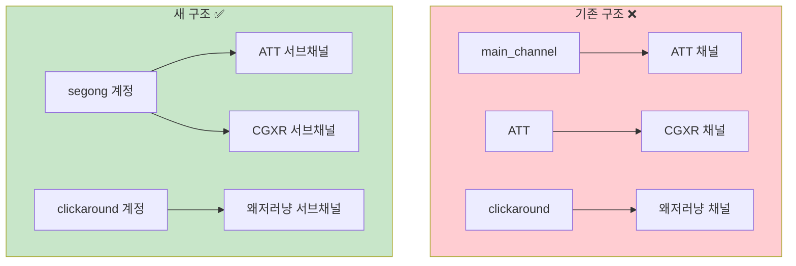
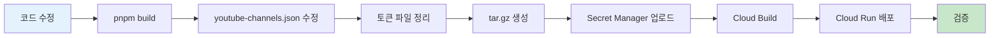

# YouTube 서브채널 기능 구현

> [!info] 문서 정보
> | 항목 | 내용 |
> |------|------|
> | **작성일** | 2025-12-21 |
> | **작업 유형** | 기능 구현 + 구조 리팩토링 |
> | **영향 범위** | YouTube Upload API |

---

## 개요

하나의 Google 계정에서 여러 YouTube 채널(Brand Account)을 관리할 수 있도록 **서브채널(SubChannel)** 기능을 구현했습니다.



---

## 구현 내용

### 1. 타입 정의 추가

> [!code] `src/youtube-upload/types/youtube.ts`

```typescript
/**
 * 서브채널 (Brand Account) 인터페이스
 */
export interface YouTubeSubChannel {
  id: string;           // YouTube channel ID (UCxxxx...)
  title: string;        // 채널 표시 이름
  alias: string;        // API 호출용 별칭 (예: "att", "cgxr")
  customUrl?: string;   // 채널 커스텀 URL (@xxx)
  thumbnailUrl?: string;
  isDefault?: boolean;  // 기본 서브채널 여부
}
```

### 2. YouTubeChannelManager 메서드 추가

> [!code] `src/youtube-upload/services/YouTubeChannelManager.ts`

| 메서드 | 설명 |
|--------|------|
| `getSubChannels(channelName)` | 서브채널 목록 조회 |
| `getSubChannel(channelName, ref)` | alias/ID로 서브채널 조회 |
| `getDefaultSubChannel(channelName)` | 기본 서브채널 조회 |
| `resolveTargetChannelId(channelName, subChannel?)` | 업로드 대상 채널 ID 결정 |
| `addSubChannel(channelName, subChannel)` | 서브채널 추가 |
| `removeSubChannel(channelName, ref)` | 서브채널 삭제 |

### 3. YouTubeUploader 수정

> [!code] `src/youtube-upload/services/YouTubeUploader.ts`

```typescript
// 기존
uploadVideo(videoId, channelName, metadata, notifySubscribers)

// 변경 후
uploadVideo(videoId, channelName, metadata, notifySubscribers, subChannel?)
```

### 4. API 엔드포인트 추가

> [!code] `src/youtube-upload/routes/channelRoutes.ts`

| 엔드포인트 | 메서드 | 설명 |
|-----------|--------|------|
| `/api/youtube/channels/:name/sub-channels` | GET | 서브채널 목록 |
| `/api/youtube/channels/:name/sub-channels` | POST | 서브채널 추가 |
| `/api/youtube/channels/:name/sub-channels/:ref` | GET | 특정 서브채널 |
| `/api/youtube/channels/:name/sub-channels/:ref` | DELETE | 서브채널 삭제 |

---

## 구조 리팩토링

### 변경 전

```json
{
  "channels": {
    "main_channel": { "channelTitle": "ATT", ... },
    "ATT": { "channelTitle": "CGXR", ... },
    "clickaround": { "channelTitle": "왜저러냥", ... }
  }
}
```

### 변경 후

```json
{
  "channels": {
    "segong": {
      "channelName": "segong",
      "email": "sogangmetaverselab@gmail.com",
      "subChannels": [
        { "id": "UC7Qhr...", "title": "ATT", "alias": "att", "isDefault": true },
        { "id": "UCaadth...", "title": "CGXR", "alias": "cgxr" }
      ]
    },
    "clickaround": {
      "channelName": "clickaround",
      "email": "clickaround8@gmail.com",
      "subChannels": [
        { "id": "", "title": "왜저러냥", "alias": "why_cat", "isDefault": true }
      ]
    }
  }
}
```

### 토큰 파일 변경

```
변경 전:
├── youtube-tokens-main_channel.json
├── youtube-tokens-ATT.json
└── youtube-tokens-clickaround.json

변경 후:
├── youtube-tokens-segong.json      ← main_channel에서 rename
└── youtube-tokens-clickaround.json
```

---

## API 사용법

### 업로드 요청

> [!example] ATT 채널에 업로드

```bash
curl -X POST https://short-video-maker-7qtnitbuvq-uc.a.run.app/api/youtube/upload \
  -H "Content-Type: application/json" \
  -d '{
    "videoId": "cmj...",
    "channelName": "segong",
    "subChannel": "att",
    "metadata": {
      "title": "영상 제목",
      "description": "설명",
      "privacyStatus": "private"
    }
  }'
```

> [!example] CGXR 채널에 업로드

```bash
curl -X POST .../api/youtube/upload \
  -d '{
    "channelName": "segong",
    "subChannel": "cgxr",
    ...
  }'
```

### 서브채널 관리

> [!example] 서브채널 목록 조회

```bash
curl https://short-video-maker-7qtnitbuvq-uc.a.run.app/api/youtube/channels/segong/sub-channels
```

> [!success] 응답
> ```json
> {
>   "success": true,
>   "channelName": "segong",
>   "subChannels": [
>     { "alias": "att", "title": "ATT", "isDefault": true },
>     { "alias": "cgxr", "title": "CGXR" }
>   ],
>   "count": 2
> }
> ```

> [!example] 새 서브채널 추가

```bash
curl -X POST .../api/youtube/channels/clickaround/sub-channels \
  -H "Content-Type: application/json" \
  -d '{
    "id": "UCxxxx...",
    "title": "새채널",
    "alias": "new_channel",
    "customUrl": "@newchannel",
    "isDefault": false
  }'
```

---

## 배포 과정



### 명령어

```bash
# 1. 빌드
cd /mnt/d/Data/00_Personal/YTB/short-video-maker
pnpm build

# 2. Secret Manager 업데이트
cd /home/akfldk1028/.ai-agents-az-video-generator
tar czf youtube-data.tar.gz youtube-channels.json youtube-tokens-*.json
cat youtube-data.tar.gz | base64 | \
  gcloud secrets versions add YOUTUBE_DATA --data-file=- --project=dkdk-474008

# 3. Cloud Build
gcloud builds submit --config=cloudbuild.yaml \
  --project=dkdk-474008 \
  --substitutions=SHORT_SHA=v20251221

# 4. 검증
curl https://short-video-maker-7qtnitbuvq-uc.a.run.app/api/youtube/auth/health-check
```

---

## 현재 상태

> [!success] Health Check 결과

```json
{
  "healthy": true,
  "message": "All YouTube tokens are valid",
  "channels": [
    { "channelName": "segong", "status": "ok" },
    { "channelName": "clickaround", "status": "ok" }
  ]
}
```

---

## 수정된 파일 목록

| 파일 | 변경 내용 |
|------|----------|
| `src/youtube-upload/types/youtube.ts` | `YouTubeSubChannel` 인터페이스 추가 |
| `src/youtube-upload/services/YouTubeChannelManager.ts` | 서브채널 관리 메서드 추가 |
| `src/youtube-upload/services/YouTubeUploader.ts` | `subChannel` 파라미터 지원 |
| `src/youtube-upload/routes/uploadRoutes.ts` | API 문서 및 파라미터 추가 |
| `src/youtube-upload/routes/channelRoutes.ts` | 서브채널 CRUD 엔드포인트 추가 |

---

## 관련 문서

- [[YOUTUBE_NEW_CHANNEL_GUIDE|YouTube 새 채널 추가 가이드]]
- [[environment-variables|환경변수 가이드]]
- [[YOUTUBE-TOKEN-TROUBLESHOOTING|토큰 문제해결]]

---

#youtube #subchannel #api #gcp #cloudrun

**Last Updated**: 2025-12-21 15:15 KST
