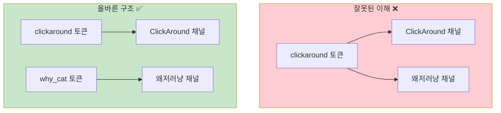

# YouTube 채널별 업로드 가이드

> [!info] 문서 정보
> | 항목 | 내용 |
> |------|------|
> | **작성일** | 2025-12-21 |
> | **최종 수정** | 2025-12-22 |
> | **용도** | N8N 워크플로우 채널별 업로드 파라미터 |

---

## 핵심 개념

> [!danger] 중요: 채널별 별도 토큰 필요!
> YouTube API는 `subChannel` 개념을 지원하지 않습니다.
> **각 YouTube 채널(Brand Account 포함)마다 별도 OAuth 토큰이 필요합니다.**



---

## 채널 목록 (Quick Reference)

| channelName | YouTube 채널 | Google 계정 | 상태 |
|-------------|--------------|-------------|:----:|
| `clickaround` | ClickAround | clickaround8@gmail.com | ✅ |
| `why_cat` | InkMilk (왜저러냥) | clickaround8@gmail.com | ✅ |
| `red_news` | 빨강나라보수공주 | clickaround8@gmail.com | ✅ |
| `blue_news_2` | 진보나라파랑왕자 | clickaround8@gmail.com | ✅ |

> [!warning] Brand Account 채널은 별도 토큰 필요
> 같은 Google 계정이라도 Brand Account 채널은 **별도 OAuth 인증**이 필요합니다.
> 인증 시 **해당 채널을 선택**해야 합니다.

---

## N8N 워크플로우 JSON 형식

### youtube_upload 객체 구조

```json
{
  "youtube_upload": {
    "enabled": true,
    "channelName": "why_cat",
    "title": "{{auto}}",
    "description": "자동 생성된 설명\n\n#shorts",
    "tags": ["shorts", "ai"],
    "privacy": "unlisted",
    "notifySubscribers": false
  }
}
```

### 파라미터 설명

| 필드 | 타입 | 필수 | 설명 |
|------|------|:----:|------|
| `enabled` | boolean | ✅ | `true`: 업로드 활성화 |
| `channelName` | string | ✅ | 채널명 (토큰 파일명과 일치해야 함) |
| `title` | string | | `{{auto}}`: 메타데이터에서 자동 생성 |
| `description` | string | | 영상 설명 |
| `tags` | string[] | | 태그 배열 |
| `privacy` | string | | `private`/`unlisted`/`public` |
| `notifySubscribers` | boolean | | 구독자 알림 (기본: false) |

---

## 채널별 N8N JSON 예시

### ATT 채널

```json
"youtube_upload": {
  "enabled": true,
  "channelName": "segong",
  "privacy": "unlisted"
}
```

### CGXR 채널

```json
"youtube_upload": {
  "enabled": true,
  "channelName": "cgxr",
  "privacy": "private"
}
```

### ClickAround 채널

```json
"youtube_upload": {
  "enabled": true,
  "channelName": "clickaround",
  "privacy": "unlisted"
}
```

### 왜저러냥 채널

```json
"youtube_upload": {
  "enabled": true,
  "channelName": "why_cat",
  "privacy": "unlisted"
}
```

---

## 새 채널 추가하기 (Brand Account 포함)

### 1. API로 채널 추가

```bash
curl -X POST https://short-video-maker-7qtnitbuvq-uc.a.run.app/api/youtube/channels \
  -H "Content-Type: application/json" \
  -d '{"channelName": "why_cat"}'
```

### 2. OAuth 인증

반환된 `authUrl`로 이동하여 인증:
- **반드시 업로드할 YouTube 채널 선택!**
- Brand Account인 경우 해당 Brand Account 선택

### 3. Secret Manager 업데이트

```bash
cd /home/akfldk1028/.ai-agents-az-video-generator
tar czf youtube-data.tar.gz youtube-channels.json youtube-tokens-*.json
cat youtube-data.tar.gz | base64 | gcloud secrets versions add YOUTUBE_DATA --data-file=- --project=dkdk-474008
```

### 4. Cloud Run 재배포

```bash
gcloud run services update short-video-maker \
  --region=us-central1 \
  --project=dkdk-474008 \
  --update-secrets=YOUTUBE_DATA=YOUTUBE_DATA:latest
```

자세한 내용: [[YOUTUBE_NEW_CHANNEL_GUIDE]]

---

## API 엔드포인트

### /api/video/pexels (Pexels 영상)

```bash
curl -X POST https://short-video-maker-7qtnitbuvq-uc.a.run.app/api/video/pexels \
  -H "Content-Type: application/json" \
  -d '{
    "format_type": "timeline",
    "title": "테스트",
    "timeline": { "scenes": [...] },
    "video_config": {...},
    "elevenlabs_config": {...},
    "youtube_upload": {
      "enabled": true,
      "channelName": "why_cat",
      "privacy": "unlisted"
    }
  }'
```

### /api/youtube/upload (직접 업로드)

```bash
curl -X POST https://short-video-maker-7qtnitbuvq-uc.a.run.app/api/youtube/upload \
  -H "Content-Type: application/json" \
  -d '{
    "videoId": "cmjxxx...",
    "channelName": "why_cat",
    "metadata": {
      "title": "영상 제목",
      "description": "설명",
      "privacyStatus": "unlisted"
    }
  }'
```

---

## 트러블슈팅

> [!danger] 401 Channel not authenticated
> 해당 `channelName`의 OAuth 토큰이 없거나 만료됨
> → [[YOUTUBE_NEW_CHANNEL_GUIDE|새 채널 추가 가이드]] 참조

> [!danger] 잘못된 채널에 업로드됨
> OAuth 인증 시 **잘못된 채널을 선택**했을 가능성
> → 해당 채널용으로 다시 OAuth 인증 필요

> [!danger] Brand Account로 업로드 안됨
> Brand Account는 **별도 channelName과 토큰** 필요
> → 새 channelName으로 OAuth 인증 (해당 Brand Account 선택)

---

## 파일 구조

```
D:\Data\00_Personal\YTB\temp-yt\
├── youtube-channels.json
├── youtube-tokens-clickaround.json # ClickAround 채널
├── youtube-tokens-why_cat.json     # InkMilk/왜저러냥 채널
├── youtube-tokens-red_news.json    # 빨강나라보수공주 채널
├── youtube-tokens-blue_news_2.json # 진보나라파랑왕자 채널
├── youtube-data.tar.gz
└── youtube-data-base64.txt
```

---

#youtube #upload #n8n #api #reference

**Last Updated**: 2026-02-05 KST
